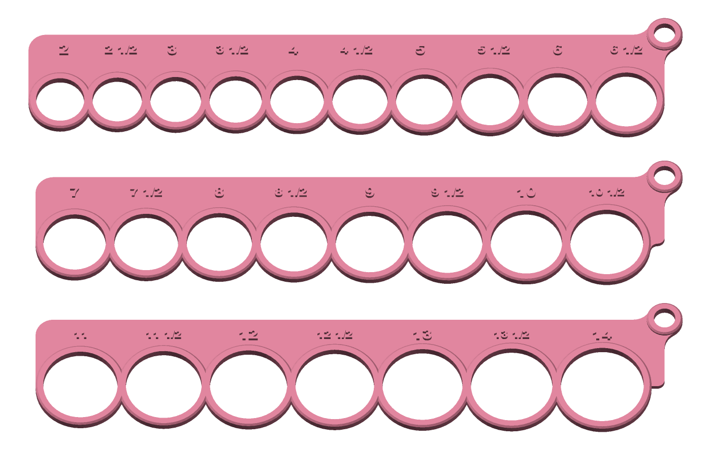
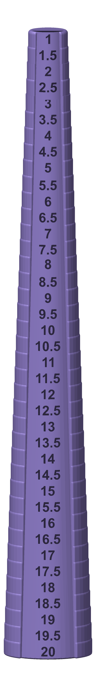
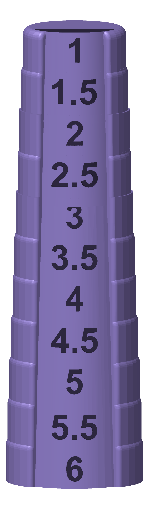
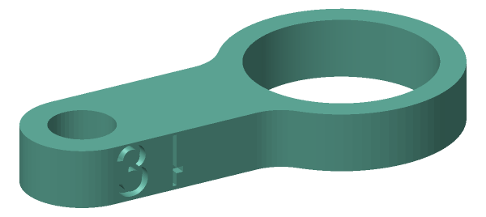
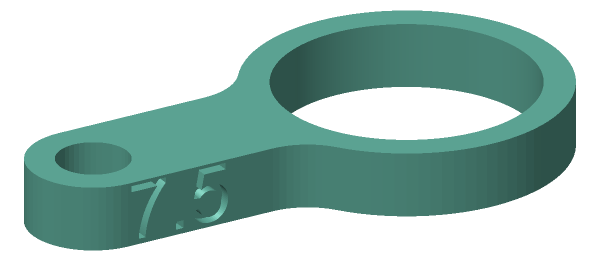
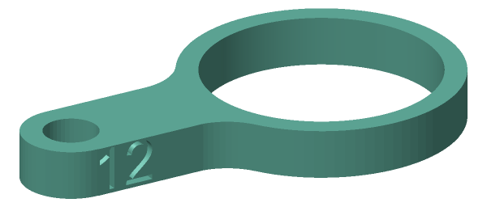
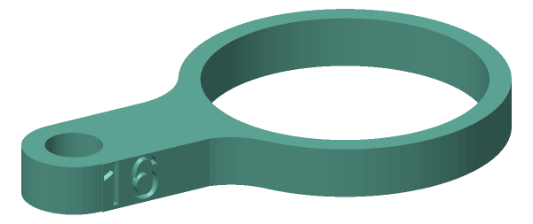
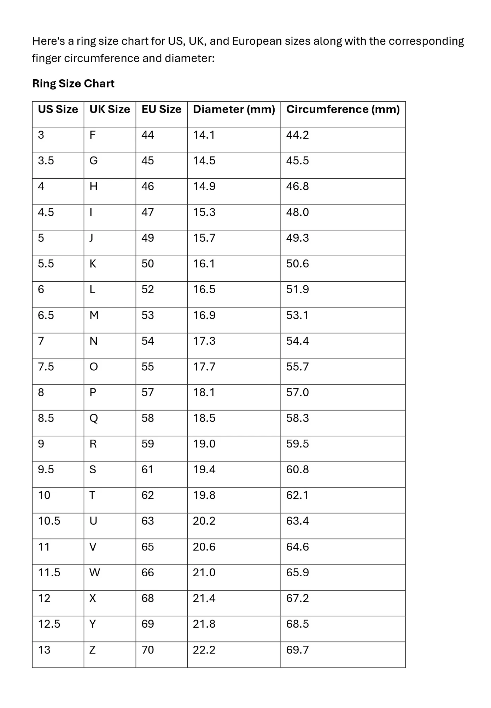

# 💍 Medidores de talle de anillos (US) para impresión 3D

Un kit para medir talles de anillo con sistema US, listo para imprimir en 3D. Tiene tres modelos que se complementan:

1. **Placas con agujeros**: para probar el dedo, talles US 2 a 14.
2. **Varilla escalonada (mandril)**: para medir un anillo que ya tenés, talles US 1 a 20.
3. **Medidores sueltos tipo llavero**: uno por talle, US 0 a 16.

> **Uso personal.** Lo armé porque necesitaba un medidor de anillos para saber qué talle regalarle a mi sobrina a medida que va creciendo. Los diseños originales son de otras personas (ver [Créditos](#créditos)). Acá están corregidos y adaptados a mi necesidad.

---

## 📁 Contenido

```
├── medidoresAnillo_todos.3mf             ← proyecto de OrcaSlicer con todo listo para laminar
├── 1 - Placas (US 2 a 14)/
│   ├── RINGSIZE2_6MEDIO_CORREGIDO_BARRA.stl
│   ├── RINGSIZE7_10MEDIO_CORREGIDO_BARRA.stl
│   ├── RINGSIZE11_14_CORREGIDO_BARRA.stl
│   ├── TORNILLO.stl                      ← une las 3 placas
│   └── TUERCA.stl
├── 2 - Varilla (US 1 a 20)/
│   └── ring size measurement rod_ CON 1 a 2.5.stl
├── 3 - Medidores sueltos (US 0 a 16)/
│   └── US_0.stl … US_16.stl              ← 33 archivos, uno por medio talle
└── imagenes/
```

---

## 1. Placas (US 2 a 14)



Son tres placas con un agujero por medio talle. Se unen con el tornillo y la tuerca por el agujerito de la esquina, y quedan como un abanico.

**Qué se corrigió respecto del original:**
- **Diámetros de los agujeros.** En el original todos los agujeros medían unos 0,4 mm de más, o sea medio talle corrido. Ahora cada agujero mide lo que dice la tabla + 0,1 mm de compensación para impresión FDM.
- **La barrita del "½".** En el original medía 0,30–0,34 mm, menos que el ancho de línea de una boquilla de 0,4, y el slicer la salteaba. Ahora mide 0,5 mm y se imprime.

## 2. Varilla escalonada (US 1 a 20)

<p>
  
  &nbsp;&nbsp;&nbsp;
  
</p>

Una varilla con un escalón de 5 mm por cada medio talle. Se mete el anillo desde arriba y el escalón donde se frena indica el talle.

**Qué se cambió respecto del original:** el original arrancaba en el talle 3. Se le agregaron los escalones **1, 1.5, 2 y 2.5** arriba de todo, con la misma forma, tipografía y profundidad de grabado que el resto. La varilla pasó de 175 a 195 mm de alto. Sin compensación, porque el anillo se mide por afuera de la pieza.

## 3. Medidores sueltos tipo llavero (US 0 a 16)

| | | | |
|:-:|:-:|:-:|:-:|
|  |  |  |  |
| US 3 | US 7.5 | US 12 | US 16 |

Hay uno por medio talle, 33 en total, con el talle US grabado en el **costado del mango**. Ojo: desde arriba no se ve, hay que girar la pieza. El agujerito de 5 mm sirve para colgarlos todos juntos de una argolla.

**Qué se cambió respecto del original:** el original venía en milímetros, con medidores de 10 a 30 mm de diámetro. Se rehicieron para que cada uno corresponda a un talle US: agujero = tabla + 0,1 mm, y el grabado muestra el talle US en vez de los mm.

---

## 📏 Tabla de talles usada



Los talles que no figuran en la tabla se completaron así:
- **0 a 2.5:** siguiendo el mismo paso de 0,4 mm por medio talle: 0 = 11,7 · ½ = 12,1 · 1 = 12,5 · 1½ = 12,9 · 2 = 13,3 · 2½ = 13,7 mm.
- **13.5 a 16:** con la escala US estándar: 13½ = 22,6 · 14 = 23,0 · 14½ = 23,4 · 15 = 23,8 · 15½ = 24,2 · 16 = 24,6 mm.

Diámetros reales de los agujeros (tabla + 0,1 mm), válidos para las placas y los medidores sueltos:

| US | Ø agujero | US | Ø agujero | US | Ø agujero |
|---|---|---|---|---|---|
| 0 | 11,8 | 5½ | 16,2 | 11 | 20,7 |
| ½ | 12,2 | 6 | 16,6 | 11½ | 21,1 |
| 1 | 12,6 | 6½ | 17,0 | 12 | 21,5 |
| 1½ | 13,0 | 7 | 17,4 | 12½ | 21,9 |
| 2 | 13,4 | 7½ | 17,8 | 13 | 22,3 |
| 2½ | 13,8 | 8 | 18,2 | 13½ | 22,7 |
| 3 | 14,2 | 8½ | 18,6 | 14 | 23,1 |
| 3½ | 14,6 | 9 | 19,1 | 14½ | 23,5 |
| 4 | 15,0 | 9½ | 19,5 | 15 | 23,9 |
| 4½ | 15,4 | 10 | 19,9 | 15½ | 24,3 |
| 5 | 15,8 | 10½ | 20,3 | 16 | 24,7 |

---

## 🖨️ Impresión

- Pensado para una **Flashforge AD5X** con el perfil por defecto a **0,20 mm** de capa (boquilla 0,4).
- Las placas y los medidores sueltos se imprimen acostados. La varilla, parada.
- **Antes de imprimir todo, imprimí un medidor y medí el agujero con un calibre.** La compensación de +0,1 mm es un promedio. Si a tu impresora los agujeros le salen muy distintos, ajustá en el slicer (en Orca: *X-Y hole compensation*).

---

## 🙏 Créditos

Los modelos originales son de sus autores. Este repo solo junta, corrige y adapta esos diseños para uso personal:

- **Placas:** [Medidor talla de anillos – tallas US (Cults3D)](https://cults3d.com/en/3d-model/jewelry/medidor-talla-de-anillos-tallas-us)
- **Varilla:** [Ring Size Measurement Kit (Cults3D)](https://cults3d.com/en/3d-model/tool/ring-size-measurement-kit/makes)
- **Medidores sueltos:** [Ring Size Measuring Set (MakerWorld)](https://makerworld.com/en/models/375946-ring-size-measuring-set?from=search#profileId-321843)

Si te sirven, pasá a darles un like a los diseños originales. 💜
